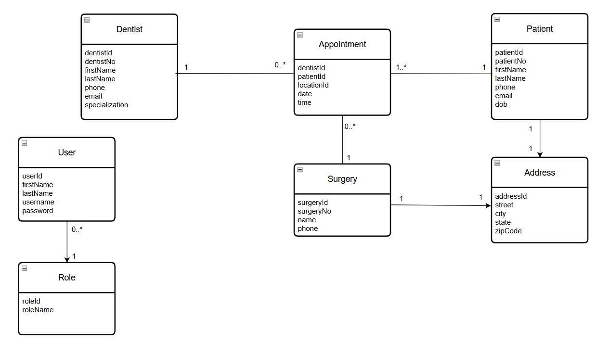

# Dental Surgeries Management System

A Spring Boot-based web application for managing a network of Dental Surgeries and related operations.

## Project Overview

This project is a comprehensive dental surgeries management system built with Spring Boot, providing a robust backend for handling dental procedures, patient information, and related operations.

## Technologies Used

- **Java 21**
- **Spring Boot 3.4.4**
- **Spring Security**
- **Spring Data JPA**
- **MySQL Database**
- **MapStruct** (for object mapping)
- **Lombok** (for reducing boilerplate code)
- **JWT** (for authentication)
- **Maven** (for dependency management)

## Features

- RESTful API endpoints
- JWT-based authentication
- Database integration with MySQL
- Object mapping with MapStruct
- Spring Security implementation
- Comprehensive testing support

## Business Requirements

### User Stories

#### Patient Management
- Hospital administrator should be able to register new patients so that their information is stored in the system
- Hospital administrator should be able to update patients information
- Hospital administrator should be able to delete patients records
- Medical staff member should be able to view patient medical history to make informed decisions about surgical procedures

#### Appointments Management
- Hospital administrator should be able to schedule appointments
- Hospital administrator should be able to update or delete appointments
- Dentists should be able to view the scheduled appointments

#### Resource Management
- Hospital administrator should be able to add, update, and delete surgeries data
- Hospital administrator should be able to add, update, and delete dentists data

#### Security and Access Control
- Hospital administrator should be able to manage patients, dentists, surgeries, and appointments data
- Dentists are only allowed to view the data

## UML


## Database Schema

The project includes a MySQL Workbench model file (`surgeries_db_schema.mwb`) that defines the database structure.


## Prerequisites

- Java 21
- Maven 3.x
- MySQL Server
- Your favorite IDE (IntelliJ IDEA recommended)

## Getting Started

1. Clone the repository:
   ```bash
   git clone [repository-url]
   ```

2. Configure the database:
   - Create a MySQL database
   - Update the database configuration in `application.properties`

3. Build the project:
   ```bash
   mvn clean install
   ```

4. Run the application:
   ```bash
   mvn spring-boot:run
   ```

## Security

The application implements Spring Security with JWT-based authentication for secure access to the API endpoints.

## Testing

The project includes comprehensive testing support with:
- JUnit 5
- Spring Test
- H2 Database for testing

## Dockerization

This application is fully containerized using Docker, allowing easy deployment and consistent environment setup across systems. It includes two services: a MySQL database and the Spring Boot-based web application.

### Running the Application

#### 1. Update Image Name
- The `docker-compose.yml` file references the image `rbadawy/surgeries:1.0.1`, which you'll need to replace with your own Docker Hub username

#### 2. Build the Docker Image
- In the terminal, run this command <pre> <code markdown> ```docker build -t your-dockerhub-username/surgeries:1.0.1 .``` </code> </pre>

#### 3. Push the Image to Docker Hub
- Login to Docker Hub <pre> <code markdown> ```docker login``` </code> </pre>
- Push the image docker <pre> <code markdown> ```push your-dockerhub-username/surgeries:1.0.1``` </code> </pre>

#### 4. Start the application
- Run the following command to start both the MySQL and web application containers <pre> <code markdown> ```docker-compose up``` </code> </pre>

#### 5. Start testing the application using postman

## Azure Deployment
This application is deployed on azure including CI/CD feature and it can be tested through postman with the URL `https://surgeriesappr-atdqhqhqbqhsgkew.centralus-01.azurewebsites.net/api/vi`

